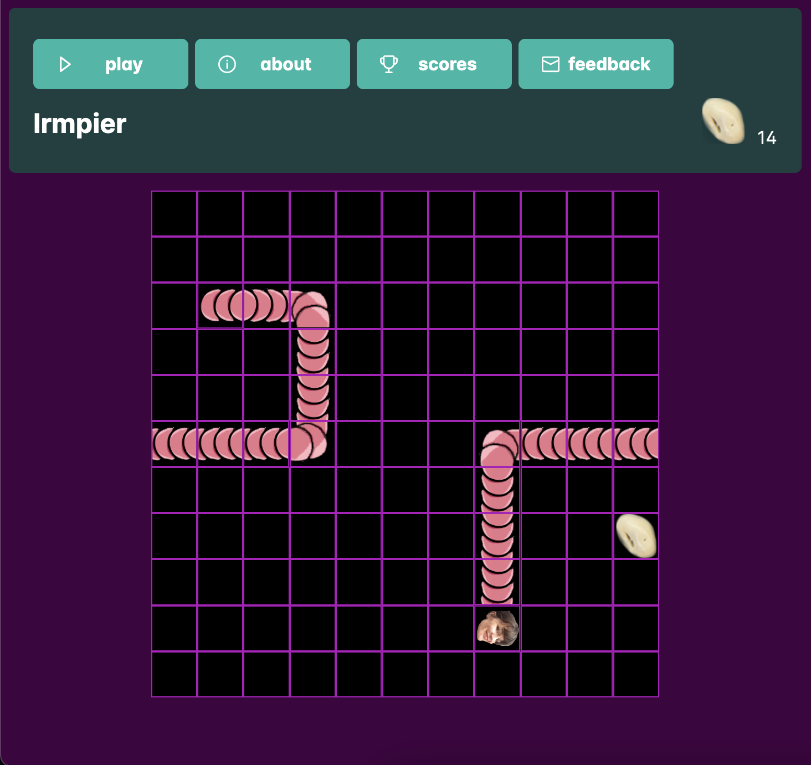

# Irmpier

Based on the traditional snake game, in this version Irma the worm ([pier](https://www.ivn.nl/afdeling/hoogeveen/over-ons/publicaties/soort-van-de-maand/september-de-regenworm-lumbricidae/)) will try to eat as many candy-pieces ([witte chocolade rozijnen](https://www.basboernoten.nl/chocolade/witte-chocolade/biologische-witte-chocolade-rozijnen)) as she can.

## Development server

Run `ng serve` for a dev server. Navigate to `http://localhost:4200/`. The application will automatically reload if you change any of the source files.

## Build

Run `ng build` to build the project. The build artifacts will be stored in the `dist/` directory.
